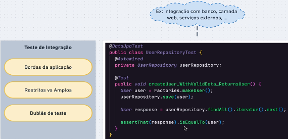
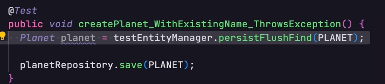

# Estudo Testes de Unidade

## Referência: Testes automatizados na prática com Spring Boot
[Compre aqui](https://www.udemy.com/course/testes-automatizados-na-pratica-com-spring-boot/)
<hr>

## Dica para leitura:
Durante o estudo, os códigos mudam pois geralmente é ensinado algo básico onde depois iremos implementar o que de fato
é utilizado no mercado de trabalho. Tome cuidado ao considerar códigos do início do estudo, se atente ao código final.

## Tópicos

- [Exercícios sobre Testes de Integração](#exercícios)
  - [Exercício 1 - ]()
  - [Exercício 2 - ]()
  - [Exercício 3 - ]()
  - [Exercício 4 - ]()
- [Resumo Sobre o Estudo](#resumo)
<hr>




Testar bordas da aplicação, quando excedemos a sua fronteira. Isso vai ocorrer quando há alguma integração com banco de dado, camada web...

Além disso, nos testes puros de unidade (unitários), só precisamos do Mockito. Dessa vez, usaremos também o SpringBoot.

Existem dois tipos de teste de ingração e eles dependem do escopo onde trabalham:

Restrito - Quando o teste trabalha somente com uma integração, uma camada (repositorio e dado por exemplo).

Amplos - Testes que cruzam outras camadas (teste de componente, por exemplo).

E para que seja possível conversar com essas camadas? Usamos dublês de teste. Se a aplicação usar um banco Oracle, por exemplo, não é necessário levantar um banco desse toda vez para testar a aplicação. Além de ser pesado, seria muito caro.

A ideia então, é criar um duble de teste! Dublar esse banco, um quebra galho. Tipo um banco H2.

Sempre teremos componentes de unidade que estão sendo testados. Ou seja, se no pacote main possuimos um Service
ou Repository, faremos o mesmo no pacote de teste.
<hr>

# Repository

## Testando cenário de sucesso no repository

Criaremos uma classe PlanetRepositoryTest com um método que irá testar a criação de um planeta
com dados válidos.

1. Lembrar de importar o PlanetRepository com injeção do AutoWired;
2. Passar no corpo do método a notação @DataJpaTest, que será responsável pela criação de um banco fake (H2);
3. Utilizar o .save para retornar um planeta dentro do método, alocando o retorno dele dentro de uma variável
do tipo Planet;
4. Criar um SUT que vai ter como retorno um testEntityManager que deve ser importado com Autowired também.

### Como verificar que o planeta que eu criei é igual ao que mandei salvar no banco?
Não seria interessante a gente verificar isso usando o repository para fazer um find, por exemplo. Ele já
está sendo utilizado pro ".save()", ou seja, se algo no repository estiver errado, tudo dará erro. Não
podemos misturar as coisas.

Neste caso, utilizaremos um **TesteEntityManager**. Ele permite que a gente interaja com o banco de dados sem ser
via repositório. Possui métodos para fazer buscas e salvar dados.

O método de busca (find), precisa de dois parâmetros: A classe e a sua id. Colocaremos isso em uma variável SUT.

Depois é só fazer os nossos Asserts. Para darem certo, precisa **lembrar de passar a dependencia H2 no pom.**
```java
@DataJpaTest
public class PlanetRepositoryTest {

    //injecao
    @Autowired
    private PlanetRepository planetRepository;

    @Autowired
    private TestEntityManager testEntityManager;

    @Test
    public void createPlanet_WithValidData_ReturnsPlanet() {
        //colocando um save em uma variável, pois ele nos
        //retorna um planeta
        Planet planet = planetRepository.save(PLANET);

        //esse .getId é do planeta que acabou de ser criado.
        //esse SUT deve ser igual ao PLANET instanciado acima.
        Planet sut = testEntityManager.find(Planet.class, planet.getId());

        System.out.println(planet);
        assertThat(sut).isNotNull();

        //como o PLANET não possui uma ID, teremos que validar
        //cada identidade
        assertThat(sut.getName()).isEqualTo(PLANET.getName());
        assertThat(sut.getClimate()).isEqualTo(PLANET.getClimate());
        assertThat(sut.getTerrain()).isEqualTo(PLANET.getTerrain());
    }
```
<hr>

## Testando cenário de dados inválidos no repository

Em um teste de dados inválidos, lançaremos exceções. 

Nesses testes, criaremos, por exemplo, duas variáveis Planet.
1. emptyPlanet - contendo todos os parâmetros null;
2. invalidPlanet - contendo parâmetros vazios.

Quando utilizermos o assertThatThrownBy, o teste não irá passar porque ele esperará as exceções.

1. Exceção sem parâmetro - Passamos nullable no @column nos atributos.
2. Exceção com parâmetro vazio - Nestes casos mais complexos envolvendo strings, utilizamos uma bilioteca
de validação: BeanValidation do Jakarta, que precisa ser adicionada no Pom.
Depois disso, usamos uma anotação em cima de cada atributo (@NotEmpty).

Depois disso, só colocar nos Asserts a instancia de RunTimeException e o teste irá passar :).

```java
    @Test
    public void createPlanet_WithInvalidData_ThrowsException() {
        Planet emptyPlanet = new Planet(null, null, null);
        Planet invalidPlanet = new Planet("", "", "");


        assertThatThrownBy(() -> planetRepository.save(invalidPlanet)).isInstanceOf(RuntimeException.class);
        assertThatThrownBy(() -> planetRepository.save(emptyPlanet)).isInstanceOf(RuntimeException.class);
    }
```
<hr>

## Testando cenário de planeta existente no repository

Como já sabemos, não usaremos o repository para salvar ou manusear dados. E sim o entitymanager.

Precisamos salvar, atualizar a mudança no banco e depois buscá-lo para ter certeza de que o
planeta está no banco.

Usaremos o **persistFlushFind** para preparar os dados.

IMPORTANTE
-
Quando passamos uma entidade como parâmetro no persistFlushFind, a instancia é alterada. Portanto,
no final da operação, ela terá um ID adicionado.

O ".save" do repository pode ser usado para duas coisa:
1. Para criar um registro;
2. Para atualizar um registro.

Pro SpringData saber qual escolher, ele só checa se o objeto possui ID ou não.
1. Se tiver ID, ele irá criar;
2. Se não tiver, ele atualiza.

Usando somente o persistFlushFind dessa forma 👇, ele só iria nesse caso atualizar um planeta, 
e não criar.



A ideia é recuperar o planet salvo, tirar seu ID e aí sim passar no .save() para ser salvo. Onde
retornará uma exceção.

Devemos definir na columa de Name da classe Planet, que a mesma será unique. Somente
um nome igual.

Por fim, é bacana entender uma coisa: mesmo que a gente tire o id do planet criado com null, o 
Hibernate entende que ele foi sim criado e está no banco de dados, e mesmo tirando esse ID, 
ele não lançará a exceção.

Então usamos o entitymanager para dar um "detach" desse planet, tiramos seu id e assim, irá funcionar.

```java
    @Test
    public void createPlanet_WithExistingName_ThrowsException() {

  //aqui salvamos, atualizamos a mudança no banco e depois buscaremos para ter certeza
  // de que funcionou.
  Planet planet = testEntityManager.persistFlushFind(PLANET);

  //desacopla pro Hibernate não olhar mais para essa instancia
  testEntityManager.detach(planet);

  //tira o ID
  planet.setId(null);

  assertThatThrownBy(() -> planetRepository.save(planet)).isInstanceOf(RuntimeException.class);
}
```
<hr>

# Controller

## Testando cenários de sucesso no Controller

Testando agora a integração entre: controlador e contexto web.

Criaremos um pacote web e uma classe PlanetControllerTest, nela:


### Cadastro de planeta com sucesso

Diferente das outras classes, no controlador, nos retornaremos o **STATUS.**
Então a nomeclatura de classe, ficará diferente, não será mais no final "ReturnsPlanet" e sim
"ReturnsCreated ou ReturnsError", etc.

Precisamos fazer uma requisição HTTP para chegar no nosso controlador. Como iremos interagir
com contexto web para fazer isso, utilizaremos o **@WebMvcTest**, onde passaremos somente o
PlanetController, para ele não inicializar todos os seus outros componentes.

Além do WebMvc inicializar o Controller, ele também monta um contexto web para interagirmos,
parecido com o banco de dados fake do Repository.

Disponibilizará um cliente HTTP para interagir com esse contexto, o MockMvc. Onde injetaremos com
AutoWired. **Precisamos construir essa requisição.**

Construindo requisição
-
1. Utilizaremos o ".perfom", que tem como parâmetro um RequestBuilder, importaremos ele de forma
estática.
<hr>

2. Dentro dele, inicializaremos o Post, passando a URI para acessar o serviço e ".content" para
passar o planeta a ser criado.


Dentro de content, precisamos transformar esse PLANET em uma string para o servidor reconhecer,
para isso utilizaremos o componente **ObjetMapper**, injetando-o com AutoWired.

Ele possui vários métodos. Neste caso específico, utilizaremos **writeValueAsString**. Ele irá
traduzir o Objeto para String, provavelmente um JSON.
<hr>

3. Para aferir os resultados, usaremos ainda no perform o ".andExpect", para colocar como parâmetro
as nossas verificações.

Este método, recebe como parâmetro um ResultMatcher (também do MockMvc). Nele, poderemos testar
várias informações da resposta que recebemos (status, conteudo do corpo da resposta, etc).

Importaremos ele de forma estática. E verificaremos dentro dele, se o status é Created!
<hr>

4. Poderemos colocar depois também uma espectativa de resposta: O que será retornado?


Pegaremos aquele conteúdo de String e transformaremos em Objeto! E assim será possível validar
esse conteúdo com o PLANET criado. Para isso, para essa comparação, usaremos jsonPath.

Dentro de jsonPath, o primeiro parâmetro será a propriedade que queremos traduzir. Passaremos uma
String como parâmetro e para referenciar um objeto usamos o "$". Se fosse para testar uma propriedade
específica, poderiamos usar "$.name", por exemplo. Neste caso, como é o objeto TODO, será somente "$".
<hr>

5. A coisa final que faltou é o service. No nosso Controller, no método de Create,
possuimos ele, correto? 

Portanto, iremos mockar o PlanetService (duble de teste), definindo a expectativa de retorno para 
o método Create. Importaremos ele com @MockBean.
<hr>

6. Com o Mock feito, definiremos o Stub.

Utilizaremos o when, exatamente como antes.
<hr>

7. Por fim, para não termos um erro 415 (midia não suportada), precisamos:

Informar o tipo do conteúdo. Depois do objectMapper passar um content + mediatype json.
<hr>

O formato de teste é diferente, porque precisamos fazer configuração de framework. Mas a estrutura é
a mesma. Temos a preparação dos dados (o when), a ação que iremos desempenhar (post) e as expectativas
(asserts) que serão o andExpect.

Código final:

```java
//para iniciar Controller + camada Web
@WebMvcTest(PlanetController.class)
public class PlanetControllerTest {

    @Autowired
    private MockMvc mockMvc;

    @Autowired
    private ObjectMapper objectMapper;

    @MockBean
    private PlanetService planetService;

    @Test
    public void createPlanet_WithValidData_ReturnCreated() throws Exception {
        //quando o planetService for chamado, ele retornará o Planet criado
        // pela camada de serviço.
        when(planetService.create(PLANET)).thenReturn(PLANET);

        //ao usar o POST, estaremos criando um planeta!
        mockMvc.perform(post("/planets").content(objectMapper.writeValueAsString(PLANET)).contentType(MediaType.APPLICATION_JSON))
                .andExpect(status().isCreated())
                .andExpect(jsonPath("$").value(PLANET));
    }
}
```
<hr>

### Testando cenário de dados invalidos no controller

O que seria os dados inválidos? 

1. Podemos usar os dois exemplos lá do repository, emptyPlanet e invalidPlanet.
<hr>

2. Fazer a chamada com o MockMvc. A estrutura irá mudar um pouco:

O objectmapper será o emptyPlanet, o retorno do status será isUnprocessableEntity, removeremos
a expectativa do jsonPath (pois não terá nenhum planeta sendo retornado).

**Repetir o mesmo para o invalidPlanet**!

Tudo isso, deverá retornar: **422**.

Com isso feito acima, na verdade ele criará um planeta: **201**. Ou seja, um bug! O controlador
não está validando os dados inválidos.

Para validar esses dados:

1. Iremos no Controller e validaremos esses campos com a bilioteca BeanValidation.

Para isso, é só passar @Valid no método create do nosso Controller.

Como resultado, o teste agora retornará: **400**.
<hr>

Para retornar por fim nosso 422, criaremos um componente novo na implementação: Um tratador de 
exceção, veja:

1. Dentro do Web, criaremos um novo componente: GeneralExceptionHandler (um manejador de exceção
genérico).

Ele terá anotação ControllerAdvice. Essa anotação permite que essa nova classe, trate uma exceção
(código) e esse comportamente seja herdado pelos controladores do nosso projeto. Isso é otimo para 
que a gente não precise ficar fazendo tratamento manual.

Ou seja, cria num local específico e todo mundo irá se beneficiar dele.

**A classe irá extender ResponseEntityExceptionHandler.**

Assim, já teremos alguns métodos prontos, um deles é argumentos invalidos: handleMethodArgumentNotValid.

E assim, iremos sobrescrever esse comportamento, definindo o código de resposta que queremos retornar.

Método padrão:

```java
@ControllerAdvice
public class GeneralExceptionHandler extends ResponseEntityExceptionHandler {
    @Override
    protected ResponseEntity<Object> handleMethodArgumentNotValid(MethodArgumentNotValidException ex, HttpHeaders headers, HttpStatusCode status, WebRequest request) {
        return super.handleMethodArgumentNotValid(ex, headers, status, request);
    }
}
```

Com alteração: Alteramos o status para o UNPROCESSABLE.
```java
@ControllerAdvice
public class GeneralExceptionHandler extends ResponseEntityExceptionHandler {
    @Override
    protected ResponseEntity<Object> handleMethodArgumentNotValid(MethodArgumentNotValidException ex, HttpHeaders headers, HttpStatusCode status, WebRequest request) {
        return super.handleMethodArgumentNotValid(ex, headers, HttpStatus.UNPROCESSABLE_ENTITY, request);
    }
}
```

Código final do controller:
```java
    @Test
    public void createPlanet_WithInvalidData_ReturnsBadRequest()  throws Exception{
        Planet emptyPlanet = new Planet(null, null, null);
        Planet invalidPlanet = new Planet("", "", "");

        mockMvc.perform(post("/planets").content(objectMapper.writeValueAsString(emptyPlanet)).contentType(MediaType.APPLICATION_JSON))
                .andExpect(status().isUnprocessableEntity());

        mockMvc.perform(post("/planets").content(objectMapper.writeValueAsString(invalidPlanet)).contentType(MediaType.APPLICATION_JSON))
                .andExpect(status().isUnprocessableEntity());


    }
```

# Resumo

<hr>

## Fim

