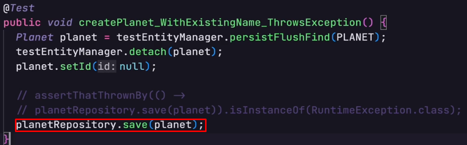
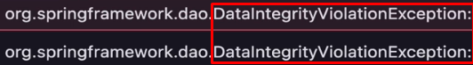
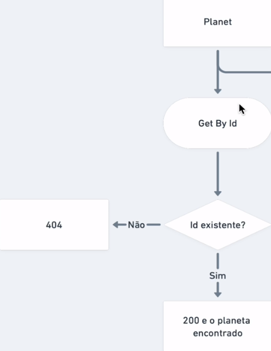
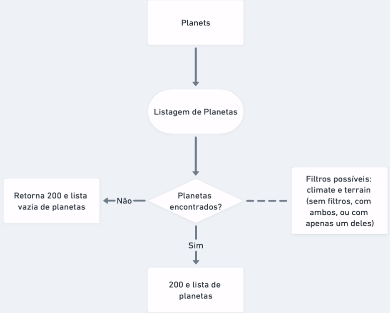

<h1 align="center">
  StarWars Planet API (sw-planet-api)
</h1>

<p align="center">
  <a href="#-technologies">Tecnologias</a>&nbsp;&nbsp;&nbsp;|&nbsp;&nbsp;&nbsp;
  <a href="#-introdução">Introdução</a>&nbsp;&nbsp;&nbsp;&nbsp;&nbsp;&nbsp;
</p>

<p align="center">
  
</p>

# Estudo Testes de Unidade

## Referência: Testes automatizados na prática com Spring Boot
[Compre aqui](https://www.udemy.com/course/testes-automatizados-na-pratica-com-spring-boot/)
<hr>

## Dica para leitura:
Durante o estudo, os códigos mudam pois geralmente é ensinado algo básico onde depois iremos implementar o que de fato
é utilizado no mercado de trabalho. Tome cuidado ao considerar códigos do início do estudo, se atente ao código final.

## ✨ Technologies

- [Mysql](https://dev.mysql.com/downloads/mysql/)
- [Java](https://www.oracle.com/java/technologies/downloads/)
- [Maven](https://maven.apache.org/download.cgi)
- [Spring Boot](https://spring.io/projects/spring-boot)
- [Spring Testing](https://docs.spring.io/spring-framework/docs/current/reference/html/testing.html#testing-introduction)
- [JUnit 5](https://junit.org/junit5/docs/current/user-guide/)
- [Mockito](https://site.mockito.org)
- [AssertJ](https://github.com/assertj/assertj)
- [Hamcrest](http://hamcrest.org/JavaHamcrest/)
- [Jacoco](https://github.com/jacoco/jacoco)
- [Pitest](https://pitest.org)

## 📌 Tópicos

* [Estudo Testes de Unidade](#estudo-testes-de-unidade)
  * [Referência: Testes automatizados na prática com Spring Boot](#referência-testes-automatizados-na-prática-com-spring-boot)
  * [Dica para leitura:](#dica-para-leitura)
  * [✨ Technologies](#-technologies)
  * [📌 Tópicos](#-tópicos)
  

* [💻 Introdução](#-introdução)
<hr>

* [Repository](#repository)
  * [🧪 Testando cenário de sucesso no repository](#-testando-cenário-de-sucesso-no-repository)
    * [❓ Como verificar que o planeta que eu criei é igual ao que mandei salvar no banco?](#-como-verificar-que-o-planeta-que-eu-criei-é-igual-ao-que-mandei-salvar-no-banco)
  * [🧪 Testando cenário de dados inválidos no repository](#-testando-cenário-de-dados-inválidos-no-repository)
  * [🧪 Testando cenário de planeta existente no repository](#-testando-cenário-de-planeta-existente-no-repository)
  * [❗ IMPORTANTE](#-importante)
<hr>

* [Controller](#controller)
  * [🧪 Testando cenários de sucesso no Controller](#-testando-cenários-de-sucesso-no-controller)
    * [Cadastro de planeta com sucesso](#cadastro-de-planeta-com-sucesso)
  * [🛠️ Construindo requisição](#-construindo-requisição)
  * [🧪 Testando cenário de dados invalidos no controller](#-testando-cenário-de-dados-invalidos-no-controller)
  * [🧪 Testando cenário de planeta existente no controller](#-testando-cenário-de-planeta-existente-no-controller)
<hr>

* [✅ Exercícios](#-exercícios)
  * [Exercício 1 - Testando consulta de planeta por ID](#exercício-1---testando-consulta-de-planeta-por-id)
    * [Controller](#controller-1)
    * [Repository](#repository-1)
<hr>

  * [Exercício 2 - Testando consulta de planeta por nome](#exercício-2---testando-consulta-de-planeta-por-nome)
    * [Controller](#controller-2)
    * [Repository](#repository-2)
<hr>

  * [Exercício 3 - Testando Listagem de Planetas](#exercício-3---testando-listagem-de-planetas)
    * [Controller](#controller-3)
    * [Repository](#repository-)
<hr>

  * [Exercício 4 - Testando remoção de planeta](#exercício-4---testando-remoção-de-planeta)
    * [Controller](#controller-4)
    * [Repository](#repository-3)
* [Resumo](#resumo)
<hr>

# 💻 Introdução


Testar bordas da aplicação, quando excedemos a sua fronteira. Isso vai ocorrer quando há alguma integração com banco de dado, camada web...

Além disso, nos testes puros de unidade (unitários), só precisamos do Mockito. Dessa vez, usaremos também o SpringBoot.

Existem dois tipos de teste de ingração e eles dependem do escopo onde trabalham:

Restrito - Quando o teste trabalha somente com uma integração, uma camada (repositorio e dado por exemplo).

Amplos - Testes que cruzam outras camadas (teste de componente, por exemplo).

E para que seja possível conversar com essas camadas? Usamos dublês de teste. Se a aplicação usar um banco Oracle, por exemplo, não é necessário levantar um banco desse toda vez para testar a aplicação. Além de ser pesado, seria muito caro.

A ideia então, é criar um duble de teste! Dublar esse banco, um quebra galho. Tipo um banco H2.

Sempre teremos componentes de unidade que estão sendo testados. Ou seja, se no pacote main possuimos um Service
ou Repository, faremos o mesmo no pacote de teste.
<hr>

# Repository

## 🧪 Testando cenário de sucesso no repository

Criaremos uma classe PlanetRepositoryTest com um método que irá testar a criação de um planeta
com dados válidos.

1. [ ] Lembrar de importar o PlanetRepository com injeção do AutoWired;
2. [ ] Passar no corpo do método a notação @DataJpaTest, que será responsável pela criação de um banco fake (H2);
3. [ ] Utilizar o .save para retornar um planeta dentro do método, alocando o retorno dele dentro de uma variável
do tipo Planet;
4. [ ] Criar um SUT que vai ter como retorno um testEntityManager que deve ser importado com Autowired também.

### ❓ Como verificar que o planeta que eu criei é igual ao que mandei salvar no banco?
Não seria interessante a gente verificar isso usando o repository para fazer um find, por exemplo. Ele já
está sendo utilizado pro ".save()", ou seja, se algo no repository estiver errado, tudo dará erro. Não
podemos misturar as coisas.

Neste caso, utilizaremos um **TesteEntityManager**. Ele permite que a gente interaja com o banco de dados sem ser
via repositório. Possui métodos para fazer buscas e salvar dados.

O método de busca (find), precisa de dois parâmetros: A classe e a sua id. Colocaremos isso em uma variável SUT.

Depois é só fazer os nossos Asserts. Para darem certo, precisa **lembrar de passar a dependencia H2 no pom.**
```java
@DataJpaTest
public class PlanetRepositoryTest {

    //injecao
    @Autowired
    private PlanetRepository planetRepository;

    @Autowired
    private TestEntityManager testEntityManager;

    @Test
    public void createPlanet_WithValidData_ReturnsPlanet() {
        //colocando um save em uma variável, pois ele nos
        //retorna um planeta
        Planet planet = planetRepository.save(PLANET);

        //esse .getId é do planeta que acabou de ser criado.
        //esse SUT deve ser igual ao PLANET instanciado acima.
        Planet sut = testEntityManager.find(Planet.class, planet.getId());

        System.out.println(planet);
        assertThat(sut).isNotNull();

        //como o PLANET não possui uma ID, teremos que validar
        //cada identidade
        assertThat(sut.getName()).isEqualTo(PLANET.getName());
        assertThat(sut.getClimate()).isEqualTo(PLANET.getClimate());
        assertThat(sut.getTerrain()).isEqualTo(PLANET.getTerrain());
    }
}
```
<hr>


## 🧪 Testando cenário de dados inválidos no repository

Em um teste de dados inválidos, lançaremos exceções. 

Nesses testes, criaremos, por exemplo, duas variáveis Planet.
1. emptyPlanet - contendo todos os parâmetros null;
2. invalidPlanet - contendo parâmetros vazios.

Quando utilizermos o assertThatThrownBy, o teste não irá passar porque ele esperará as exceções.

1. Exceção sem parâmetro - Passamos nullable no @column nos atributos.
2. Exceção com parâmetro vazio - Nestes casos mais complexos envolvendo strings, utilizamos uma bilioteca
de validação: BeanValidation do Jakarta, que precisa ser adicionada no Pom.
Depois disso, usamos uma anotação em cima de cada atributo (@NotEmpty).

Depois disso, só colocar nos Asserts a instancia de RunTimeException e o teste irá passar :).

```java
    @Test
    public void createPlanet_WithInvalidData_ThrowsException() {
        Planet emptyPlanet = new Planet(null, null, null);
        Planet invalidPlanet = new Planet("", "", "");


        assertThatThrownBy(() -> planetRepository.save(invalidPlanet)).isInstanceOf(RuntimeException.class);
        assertThatThrownBy(() -> planetRepository.save(emptyPlanet)).isInstanceOf(RuntimeException.class);
    }
```
<hr>

## 🧪 Testando cenário de planeta existente no repository

Como já sabemos, não usaremos o repository para salvar ou manusear dados. E sim o entitymanager.

Precisamos salvar, atualizar a mudança no banco e depois buscá-lo para ter certeza de que o
planeta está no banco.

Usaremos o **persistFlushFind** para preparar os dados.

❗ IMPORTANTE
-
Quando passamos uma entidade como parâmetro no persistFlushFind, a instancia é alterada. Portanto,
no final da operação, ela terá um ID adicionado.

O ".save" do repository pode ser usado para duas coisa:
1. Para criar um registro;
2. Para atualizar um registro.

Pro SpringData saber qual escolher, ele só checa se o objeto possui ID ou não.
1. Se tiver ID, ele irá criar;
2. Se não tiver, ele atualiza.

Usando somente o persistFlushFind dessa forma 👇, ele só iria nesse caso atualizar um planeta, 
e não criar.


A ideia é recuperar o planet salvo, tirar seu ID e aí sim passar no .save() para ser salvo. Onde
retornará uma exceção.

Devemos definir na columa de Name da classe Planet, que a mesma será unique. Somente
um nome igual.

Por fim, é bacana entender uma coisa: mesmo que a gente tire o id do planet criado com null, o 
Hibernate entende que ele foi sim criado e está no banco de dados, e mesmo tirando esse ID, 
ele não lançará a exceção.

Então usamos o entitymanager para dar um "detach" desse planet, tiramos seu id e assim, irá funcionar.

```java
    @Test
    public void createPlanet_WithExistingName_ThrowsException() {

  //aqui salvamos, atualizamos a mudança no banco e depois buscaremos para ter certeza
  // de que funcionou.
  Planet planet = testEntityManager.persistFlushFind(PLANET);

  //desacopla pro Hibernate não olhar mais para essa instancia
  testEntityManager.detach(planet);

  //tira o ID
  planet.setId(null);

  assertThatThrownBy(() -> planetRepository.save(planet)).isInstanceOf(RuntimeException.class);
}
```
<hr>

# Controller

## 🧪 Testando cenários de sucesso no Controller

Testando agora a integração entre: controlador e contexto web.

Criaremos um pacote web e uma classe PlanetControllerTest.


### Cadastro de planeta com sucesso

Diferente das outras classes, no controlador, nos retornaremos o **STATUS.**
Então a nomeclatura de classe, ficará diferente não será mais no final "ReturnsPlanet" e sim
"ReturnsCreated ou ReturnsError", etc.

Precisamos fazer uma requisição HTTP para chegar no nosso controlador. Como iremos interagir
com contexto web para fazer isso, utilizaremos o **@WebMvcTest**, onde passaremos somente o
PlanetController, para ele não inicializar todos os seus outros componentes.

Além do WebMvc inicializar o Controller, ele também monta um contexto web para interagirmos,
parecido com o banco de dados fake do Repository.

Disponibilizará um cliente HTTP para interagir com esse contexto, o MockMvc. Onde injetaremos com
AutoWired. **Precisamos construir essa requisição.**

🛠️ Construindo requisição
-

### ETAPA 1
1. [ ] Utilizaremos o ".perfom", que tem como parâmetro um RequestBuilder, importaremos ele de forma estática.
<hr>

### ETAPA 2
2. [ ] Dentro dele, inicializaremos o Post, passando a URI para acessar o serviço e ".content" para passar o planeta a ser criado.

Dentro de content, precisamos transformar esse PLANET em uma string para o servidor reconhecer,
para isso utilizaremos o componente **ObjetMapper**, injetando-o com AutoWired.

Ele possui vários métodos. Neste caso específico, utilizaremos **writeValueAsString**. Ele irá
traduzir o Objeto para String, provavelmente um JSON.
<hr>

### ETAPA 3
3. [ ] Para aferir os resultados, usaremos ainda no perform o ".andExpect", para colocar como parâmetro
as nossas verificações.

Este método, recebe como parâmetro um ResultMatcher (também do MockMvc). Nele, poderemos testar
várias informações da resposta que recebemos (status, conteudo do corpo da resposta, etc).

Importaremos ele de forma estática. E verificaremos dentro dele, se o status é Created!
<hr>

### ETAPA 4
4. [ ] Poderemos colocar depois também uma espectativa de resposta: O que será retornado?


Pegaremos aquele conteúdo de String e transformaremos em Objeto! E assim será possível validar
esse conteúdo com o PLANET criado. Para isso, para essa comparação, usaremos jsonPath.

Dentro de jsonPath, o primeiro parâmetro será a propriedade que queremos traduzir. Passaremos uma
String como parâmetro e para referenciar um objeto usamos o "$". Se fosse para testar uma propriedade
específica, poderiamos usar "$.name", por exemplo. Neste caso, como é o objeto TODO, será somente "$".
<hr>

### ETAPA 5
5. [ ] A coisa final que faltou é o service. No nosso Controller, no método de Create,
possuimos ele, correto? 

Portanto, iremos mockar o PlanetService (duble de teste), definindo a expectativa de retorno para 
o método Create. Importaremos ele com @MockBean.
<hr>

### ETAPA 6
6. [ ] Com o Mock feito, definiremos o Stub.

Utilizaremos o when, exatamente como antes.
<hr>

### ETAPA 7
7. [ ] Por fim, para não termos um erro 415 (midia não suportada), precisamos:

Informar o tipo do conteúdo. Depois do objectMapper passar um content + mediatype json.
<hr>

O formato de teste é diferente, porque precisamos fazer configuração de framework. Mas a estrutura é
a mesma. Temos a preparação dos dados (o when), a ação que iremos desempenhar (post) e as expectativas
(asserts) que serão o andExpect.

Código final:

```java
//para iniciar Controller + camada Web
@WebMvcTest(PlanetController.class)
public class PlanetControllerTest {

    @Autowired
    private MockMvc mockMvc;

    @Autowired
    private ObjectMapper objectMapper;

    @MockBean
    private PlanetService planetService;

    @Test
    public void createPlanet_WithValidData_ReturnCreated() throws Exception {
        //quando o planetService for chamado, ele retornará o Planet criado
        // pela camada de serviço.
        when(planetService.create(PLANET)).thenReturn(PLANET);

        //ao usar o POST, estaremos criando um planeta!
        mockMvc.perform(post("/planets").content(objectMapper.writeValueAsString(PLANET)).contentType(MediaType.APPLICATION_JSON))
                .andExpect(status().isCreated())
                .andExpect(jsonPath("$").value(PLANET));
    }
}
```
<hr>

## 🧪 Testando cenário de dados invalidos no controller

O que seria os dados inválidos? 

1. Podemos usar os dois exemplos lá do repository, emptyPlanet e invalidPlanet.
<hr>

2. Fazer a chamada com o MockMvc. A estrutura irá mudar um pouco:

O objectmapper será o emptyPlanet, o retorno do status será isUnprocessableEntity, removeremos
a expectativa do jsonPath (pois não terá nenhum planeta sendo retornado).

**Repetir o mesmo para o invalidPlanet**!

Tudo isso, deverá retornar: **422**.

Com isso feito acima, na verdade ele criará um planeta: **201**. Ou seja, um bug! O controlador
não está validando os dados inválidos.

Para validar esses dados:

### ETAPA 1
1. [ ] Iremos no Controller e validaremos esses campos com a bilioteca BeanValidation.

Para isso, é só passar @Valid no método create do nosso Controller.

Como resultado, o teste agora retornará: **400**.
<hr>

Para retornar por fim nosso 422, criaremos um componente novo na implementação: Um tratador de 
exceção, veja:

### ETAPA 2
2. [ ] Dentro do pacote Web, criaremos um novo componente: GeneralExceptionHandler (um manejador de exceção
genérico).

Ele terá anotação ControllerAdvice. Essa anotação permite que essa nova classe, trate uma exceção
(código) e esse comportamente seja herdado pelos controladores do nosso projeto. Isso é otimo para 
que a gente não precise ficar fazendo tratamento manual.

Ou seja, cria num local específico e todo mundo irá se beneficiar dele.

**A classe irá extender ResponseEntityExceptionHandler.**

Assim, já teremos alguns métodos prontos, um deles é argumentos invalidos: handleMethodArgumentNotValid.

E assim, iremos sobrescrever esse comportamento, definindo o código de resposta que queremos retornar.

Método padrão:

```java
@ControllerAdvice
public class GeneralExceptionHandler extends ResponseEntityExceptionHandler {
    @Override
    protected ResponseEntity<Object> handleMethodArgumentNotValid(MethodArgumentNotValidException ex, HttpHeaders headers, HttpStatusCode status, WebRequest request) {
        return super.handleMethodArgumentNotValid(ex, headers, status, request);
    }
}
```

Com alteração: Alteramos o status para o UNPROCESSABLE.
```java
@ControllerAdvice
public class GeneralExceptionHandler extends ResponseEntityExceptionHandler {
    @Override
    protected ResponseEntity<Object> handleMethodArgumentNotValid(MethodArgumentNotValidException ex, HttpHeaders headers, HttpStatusCode status, WebRequest request) {
        return super.handleMethodArgumentNotValid(ex, headers, HttpStatus.UNPROCESSABLE_ENTITY, request);
    }
}
```

Código final do controller:
```java
    @Test
    public void createPlanet_WithInvalidData_ReturnsBadRequest()  throws Exception{
        Planet emptyPlanet = new Planet(null, null, null);
        Planet invalidPlanet = new Planet("", "", "");

        mockMvc.perform(post("/planets").content(objectMapper.writeValueAsString(emptyPlanet)).contentType(MediaType.APPLICATION_JSON))
                .andExpect(status().isUnprocessableEntity());

        mockMvc.perform(post("/planets").content(objectMapper.writeValueAsString(invalidPlanet)).contentType(MediaType.APPLICATION_JSON))
                .andExpect(status().isUnprocessableEntity());


    }
```
<hr>

## 🧪 Testando cenário de planeta existente no controller

Testando cenário de conflito (pois o planeta já existe). Para isso, teremos que criar um teste específico.

Para sabermos o tipo de exceção que será lançada, a gente pode voltar no RepositoryTest e no método
de teste de criação de planeta, comentar o código de assertThatThrownBy e iniciar utilizando somente o
planetRepository.save, veja:



Exceção lançada:



Agora, precisamos tratar a exceção DataIntegrity. Dentro da Classe General Exception, faremos o seguinte:

### ETAPA 1
1. [ ] Usaremos a anotação @ExceptionHandler, e como parâmetro, passaremos a exceção a ser tratada;
2. [ ] Criaremos o método handleConflict que retornará uma ResponseEntity
3. [ ] No parâmetro, passaremos a exceção a ser lançada. Isso é otimo, pois se quisermos fazer alguns ifs dentro
do método, é possivel. Nem sempre toda DataIntegrity seria um conflito, por exemplo.

```java
    private ResponseEntity<Object> handleConflict(DataIntegrityViolationException ex) {
        return ResponseEntity.status(HttpStatus.CONFLICT)
                .body(ex.getMessage());
    }
```

### ETAPA 2

Agora, no controller nosso método irá funcionar e o teste dará ok. :)
<hr>

# ✅ Exercícios

## Exercício 1 - Testando consulta de planeta por ID



### Controller

```java
    @Test
    public void getPlanet_WithExistingId_ReturnsPlanet() throws Exception {
        //quando o service retorna um planeta
        when(planetService.get(1L)).thenReturn(Optional.of(PLANET));
        
        //o mesmo planeta é retornado pelo controlador no final
        mockMvc
                .perform(
                    get("/planets/1"))
                .andExpect(status().isOk())
                .andExpect(jsonPath("$").value(PLANET));
    }

    @Test
    public void getPlanet_WithInvalidId_ReturnsNotFound() throws Exception {
        //quando o service não retorna nada
        // ou seja, não temum stub, ele retorna notFound
        mockMvc.perform(
                get("/planets/1"))
                .andExpect(status().isNotFound());
    }
```
<hr>

### Repository

Para não termos nenhum erro de testar um ID que já foi criado num teste, podemos criar uma estrategia
de zerar os Ids a cada teste feito.

Para isso, na classe repository, criamos:
```java
    @AfterEach
    public void afterEach() {
        PLANET.setId(null);
    }
```

AfterEach serve, portanto, para operações de limpeza após cada teste realizado. 

```java
    @Test
    public void getPlanet_ByExistingId_ReturnsPlanet()  {
        Planet planet = testEntityManager.persistFlushFind(PLANET);
        Optional<Planet> planetOpt = planetRepository.findById(planet.getId());
        assertThat(planetOpt).isNotEmpty();
        assertThat(planetOpt.get()).isEqualTo(planet);
    }

    @Test
    public void getPlanet_ByUnexistingId_ReturnsEmpty() {
        Optional<Planet> planetOpt = planetRepository.findById(1L);
        assertThat(planetOpt).isEmpty();
    }
```
<hr>

## Exercício 2 - Testando consulta de planeta por nome

### Controller

```java
    @Test
    public void getPlanet_ByExistingName_ReturnsPlanet() throws Exception {
        when(planetService.getByName(PLANET.getName())).thenReturn(Optional.of(PLANET));

        mockMvc
                .perform(
                        get("/planets/name/" + PLANET.getName()))
                .andExpect(status().isOk())
                .andExpect(jsonPath("$").value(PLANET));

    }

    @Test
    public void getPlanet_ByUnexistingName_ReturnsNotFound() throws Exception{
        mockMvc.perform(
                get("/planets/name/1"))
                .andExpect(status().isNotFound());
    }
```
<hr>

### Repository

```java
    @Test
    public void getPlanet_ByExistingName_ReturnsPlanet() {
        Planet planet = testEntityManager.persistFlushFind(PLANET);
        Optional<Planet> planetOpt = planetRepository.findByName(PLANET.getName());
        assertThat(planetOpt).isNotEmpty();
        assertThat(planetOpt.get()).isEqualTo(planet);
    }

    @Test
    public void getPlanet_ByUnexistingName_ReturnsNotFound() {
        Optional<Planet> planetOpt = planetRepository.findByName("name");
        assertThat(planetOpt).isEmpty();
    }
```
<hr>

## Exercício 3 - Testando Listagem de Planetas



### Controller


```java
    @Test
    public void listPlanets_ReturnsFilteredPlanets() throws Exception {
        //primeiro teste, não passando nenhum filtro e ver se algum
        //planeta é listado
        when(planetService.list(null, null)).thenReturn(PLANETS);
        
        //segundo teste passando filtro (terreno e clima)
        //vendo se apenas o planeta que passamos (TATOOINE), é listado
        when(planetService.list(TATOOINE.getTerrain(), TATOOINE.getClimate())).thenReturn(List.of(TATOOINE));

        //teste sem filtro, para ver se retorna tudo
        mockMvc
                .perform(
                        get("/planets"))
                .andExpect(status().isOk())
                //verificamos o tamanho do array com hasSize
                // (biblioteca do hamCrast)
                .andExpect(jsonPath("$", hasSize(3)));

        //teste pra ver se retorna somente tatooine, quando passa
        //filtro de terreno e clima.
        mockMvc
                .perform(
                  get("/planets?" + String.format("terrain=%s%climate=%s", TATOOINE.getTerrain(), TATOOINE.getClimate())))
                .andExpect(status().isOk())
                
                //filtro de planeta, tamanho esperado 1
                .andExpect(jsonPath("$", hasSize(1)))
                
                //pegando o primeiro elemento e vendo se é 
                //igual a tatooine
                .andExpect(jsonPath("$[0]").value(TATOOINE));
}
    

    @Test
    public void listPlanets_ReturnsNoPlanets() throws Exception {
        //stub sem passar nenhum filtro, para retornar lista vazia
        when(planetService.list(null, null)).thenReturn(Collections.emptyList());

        mockMvc
                .perform(
                        //verifica que a lista retornada, é vazia
                        get("/planets"))
                .andExpect(status().isOk())
                .andExpect(jsonPath("$", hasSize(0)));

    }
```
<hr>

### Repository 

Nos testes antriores, estávamos usando o entityManager para persistir os dados preparados para teste.

Nesse caso de lista, é legal a gente ter mais de um planeta, para saber se filtragem está funcionando. Por isso
utilizamos o Script SQL, carregando uma massa de dados para ver a listagem funciona.

```java
    //anotacao para carregar os scripts
    //quando rodarmos o teste, já terá dois planetas no banco de dados
    @Sql(scripts = "/import_planets.sql")
    @Test
    public void listPlanets_ReturnsFilteredPlanets() {
    
        Example<Planet> queryWithoutFilters = QueryBuilder.makeQuery(new Planet());
        
        //usando querybuilder pra passar os planetas que queremos usar
        Example<Planet> queryWithFilters = QueryBuilder.makeQuery(new Planet(TATOOINE.getClimate(), TATOOINE.getTerrain()));

        //consulta usando as querys construidas acima
        List<Planet> responseWithoutFilters = planetRepository.findAll(queryWithoutFilters);
        List<Planet> responseWithFilters = planetRepository.findAll(queryWithFilters);

        //se não tiver filtro, queremos o retorno de 3 planetas
        assertThat(responseWithoutFilters).isNotEmpty();
        assertThat(responseWithoutFilters).hasSize(3);

        //se tiver filtro, quero o retorno de 1 planeta (o filtrado)
        assertThat(responseWithFilters).isNotEmpty();
        assertThat(responseWithFilters).hasSize(1);
        assertThat(responseWithFilters.get(0)).isEqualTo(TATOOINE);

    }

    @Test
    public void listPlanets_ReturnsNoPlanets() {
        //query sem filtro pra filtrar nenhum planeta
        Example<Planet> query = QueryBuilder.makeQuery(new Planet());

        //find
        List<Planet> response = planetRepository.findAll(query);

        //verifica resposta vazia
        assertThat(response).isEmpty();
    }
```
<hr>

## Exercício 4 - Testando remoção de planeta

Dois cenários: Deletando com um ID que existe (retorna 204) e deletando com um ID que não existe (retorna 404).

Aqui devemos considerar alguns comportamentos. Se tentarmos excluir um planeta, por exemplo, com um ID que não existe,
ele vai retornar not found, mas precisamos tratar essa exceção. 

Faremos isso como já sabemos no GeneralExceptionHandler.

### Controller

Como os stubs são usados para amarrar comportamento, ou seja, quando fizermos uma chamada de método, irá acontecer
algo. Nesse caso em pauta, não teremos nenhum retorno, portanto, não necessita-se de um stub.
```java
    @Test
    public void removePlanet_WithExistingId_ReturnsNoContent() throws Exception {
        //como o retorno não tem nenhum contetudo,
        //não precisa fazer stub
        mockMvc.perform(
                delete("/planets/1"))
                .andExpect(status().isNoContent());

    }
```

Já na remoção com ID inexistente, precisamos de um stub, pois será retornado uma exceção.

Geralmente, os nossos stubs são criados com ``when(condicao).thenTrhow``. Dessa vez, como pode ser visto no código
abaixo, usamos o doThrow. Isso acontece, porque o método ``planetService.remove()``, retorna VOID. O When não suporta
métodos que retornem void.

Então a gente inverte, primeiro a exceção a ser lançada, depois o serviço e por fim o método (remove).
```java
    @Test
    public void removePlanet_WithUnexistingId_ReturnsNotFound() throws Exception {
        final Long planetId = 1L;

        doThrow(new EmptyResultDataAccessException(1)).when(planetService).remove(planetId);

        mockMvc.perform(
                delete("/planets/" + planetId))
                .andExpect(status().isNotFound());
    }
```
<hr>

### Repository

Aqui foi mais simples pois não teve nenhuma novidade.

```java
    @Test
    public void removePlanet_WithExistingId_ReturnsNoContent() {
        Planet planet = testEntityManager.persistFlushFind(PLANET);

        planetRepository.deleteById(planet.getId());

        Planet removedPlanet = testEntityManager.find(Planet.class, planet.getId());

        assertThat(removedPlanet).isNull();
    }

    @Test
    public void removePlanet_WithUnexistingId_ReturnsNotFound() {
        assertThatThrownBy(() -> planetRepository.deleteById(1L)).isInstanceOf(EmptyResultDataAccessException.class);
    }
```

# Resumo

Essa seção se utiliza mais framework (SpringBoot) do que a de [testes de unidade](https://github.com/zenonxd/estudo-testes-unidade) 
que só utiliza o mockito.

Aqui trabalhamos com as bordas de aplicação. Ou seja, interação com banco de dado/camada web.

Trabalhamos não só com Mockito mas também com SpringBoot.

Existem dois tipos de teste de integração:

1. Restrito - Quando trabalhamos somente com uma camada (repositório e dado)
2. Amplos - Quando os testes cruzam outras camadas (quando testamos componentes)
<hr>


Agora, iremos para [testes subcutâneos](https://github.com/zenonxd/estudo-testes-subcutaneos).